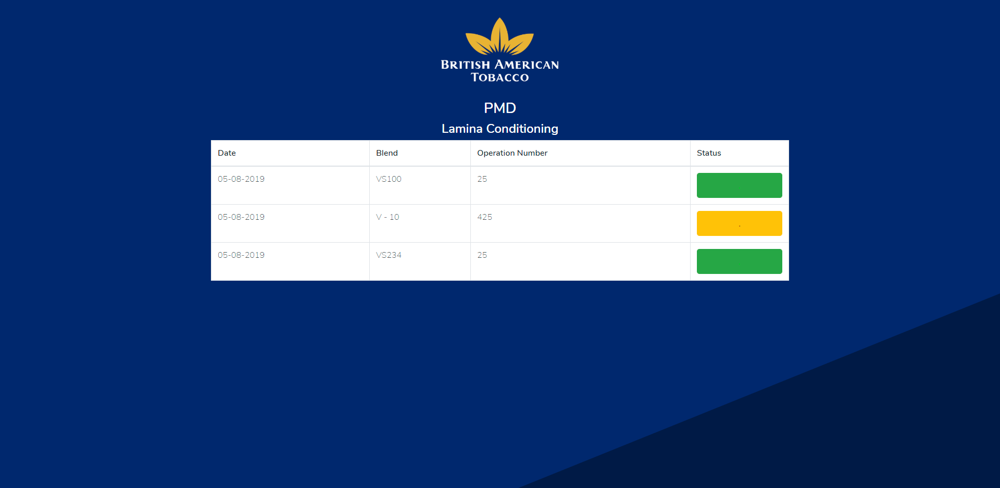

  

 

<h6>Simple todo list manager built with django (A python framework)</h6>
<h6>Live URL: <a href="https://rafat.me/projects/django/todo/">https://rafat.me/projects/django/todo/</a></h6>

<h3>PMD for British American Tobacco</h3>
<h4>PMD Lamina Conditioning of British American Tobacco</h4>
    <a href="https://pmd.easysense.xyz">Base URL (https://pmd.easysense.xyz)</a>
     

